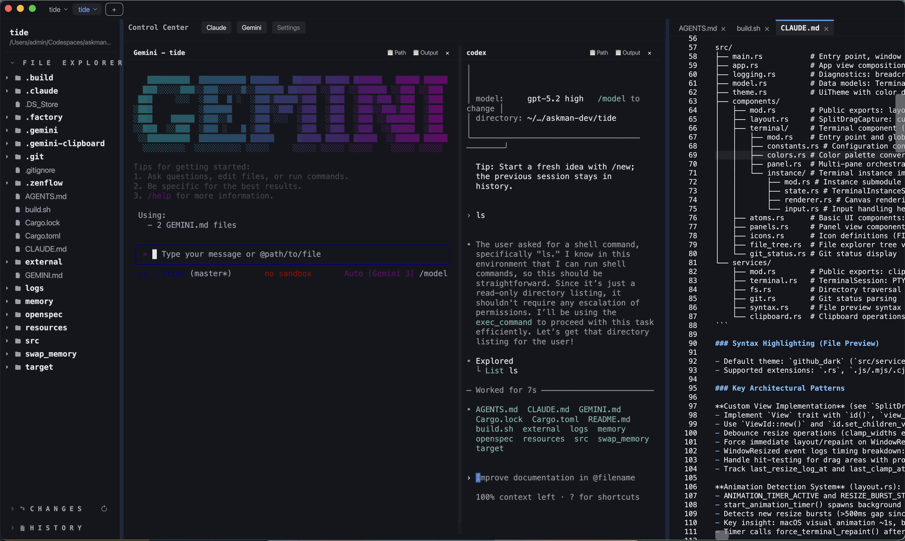

# Tide

> ⚠️ **Toy Project**: This is an experimental terminal-based IDE in early development. Features are incomplete and APIs may change without notice.

A terminal-based IDE built with Rust and the Floem UI framework.

## Screenshot



## Features

- **Three-pane layout** with resizable panels (file explorer, editor/terminal, git status)
- **Integrated terminal** with split pane support (macOS only)
- **File explorer** with collapsible panels (VSCode-style)
- **Git status** monitoring
- **Syntax highlighting** for 15+ languages (Rust, JavaScript, TypeScript, Python, Go, etc.)
- **Multi-tab workspace** management with folder switching

## Platform Support

Currently **macOS only** (terminal implementation uses `alacritty_terminal` + `portable-pty`).

## Build & Run

```bash
# Build the project
cargo build

# Run in development mode
cargo run

# Release build
cargo build --release
```

### macOS App Bundle

```bash
./build.sh
```

**Code Signing**: The build script attempts to sign the app with the certificate name in `build.sh` (currently `mac 开发根证书`). Signing is best-effort and failures are ignored (`|| true`).

## Debugging

### Environment Variables

- `TIDE_WINDOW_STYLE=fullsize` - Transparent titlebar with full content view
- `TIDE_WINDOW_STYLE=hidden` - Hidden titlebar (may cause zoom blur)
- `TIDE_DISALLOW_HIDPI=1` - Disable HiDPI scaling

Default (unset): Hidden titlebar mode optimized for tabs at top.

### Log Files

Logs are written to `logs/tide-<timestamp>.log`

Use logging functions in code:
- `logging::breadcrumb(msg)` - Lightweight event tracking (64 entry circular buffer)
- `logging::log_line(level, msg)` - Persistent logging with smart flush
- `logging::measure_ui_event(label, || {...})` - Time UI operations

### Performance Monitoring

- Slow render warnings (≥50ms) are logged automatically
- Terminal render performance tracked per pane
- UI watchdog detects hangs after 2s and dumps breadcrumbs

## Known Issues

- macOS window zoom animation causes brief UI freeze (workaround: animation timer triggers repaint after 1.2s)
- File explorer expand/collapse causes minor terminal height changes (floem cross-axis layout coupling)

## Dependencies

- **floem** (pinned to Lapce version e0dd862) - UI framework
- **alacritty_terminal** 0.25.1 - Terminal emulation (macOS)
- **portable-pty** 0.9.0 - PTY management (macOS)
- **autumnus** 0.7.x - Syntax highlighting (tree-sitter)
- **arboard** 3.x - Clipboard operations (macOS)
- **rfd** 0.15 - Native file dialogs (macOS)

## License

[License information needed]
